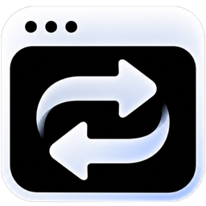
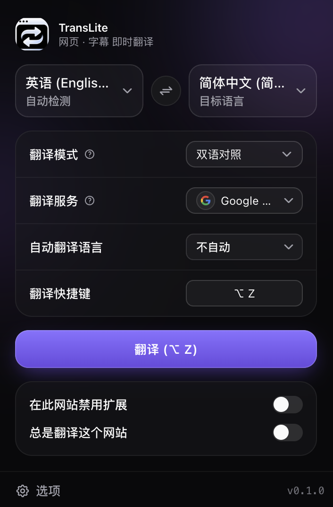
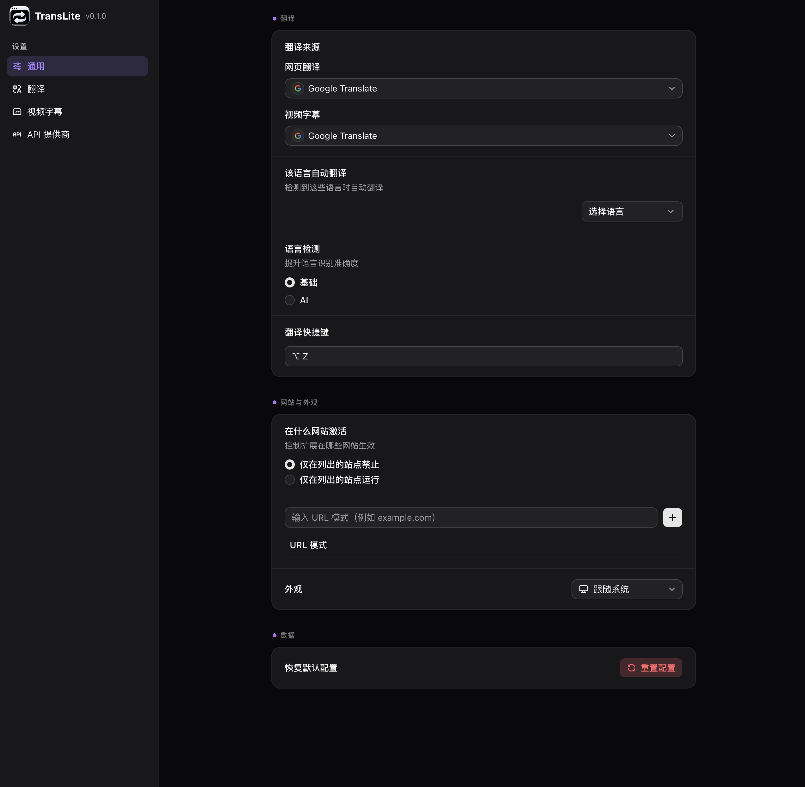
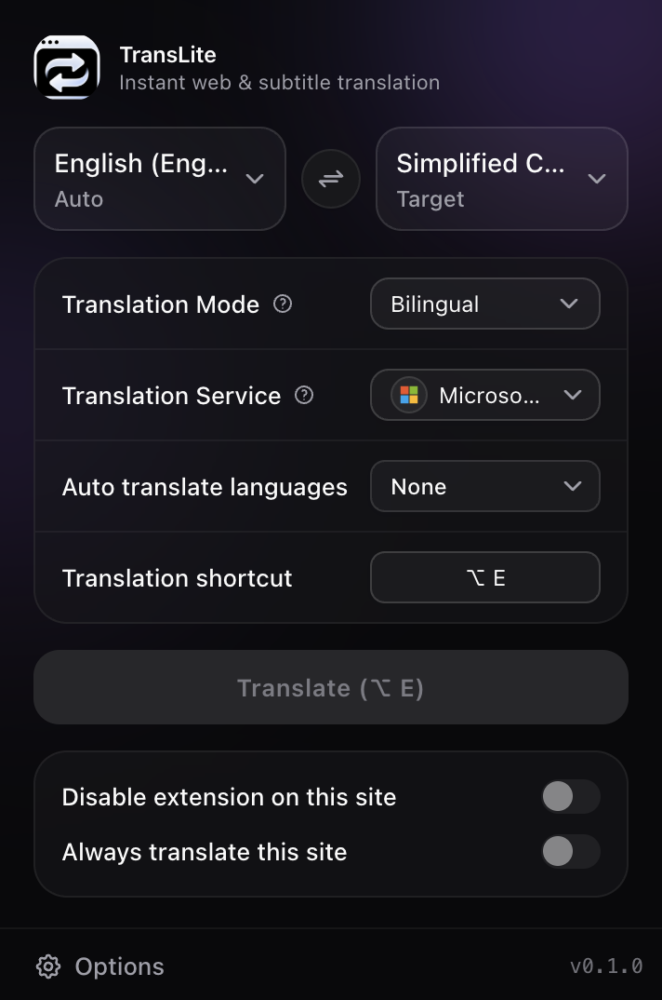
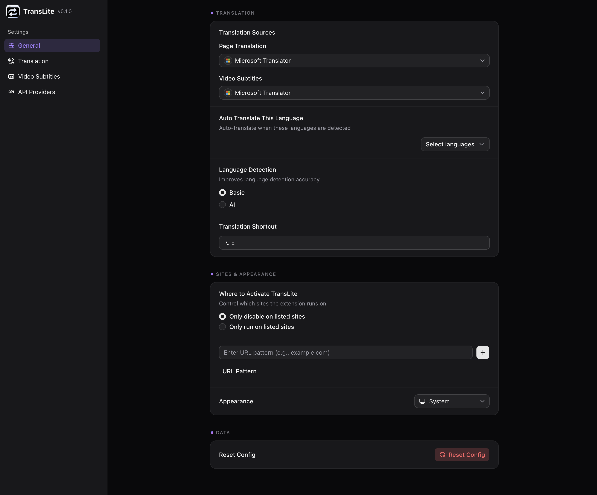

<p align="center">
  
</p>

<h1 align="center">TransLite</h1>

<p align="center">
  轻。快。不拖慢网页。
</p>

<p align="center">
  网页翻译 · YouTube 字幕翻译 · 双语阅读
</p>

<p align="center">
  <a href="#安装">安装</a> ·
  <a href="#功能">功能</a> ·
  <a href="#english">English</a>
</p>

---

## 为什么选 TransLite

- **配置简单**：上手即用。
- **永久免费**：无附加项。
- **高性能**：不开翻译时，不启动批量队列，不改页面内容，不把重型翻译运行时塞进网页。

很多翻译扩展会在每个网页里常驻重逻辑。TransLite 不这样做。

你得到的是：

- 网页加载更轻
- 浏览更顺
- 不翻译时更安静
- 要翻译时，一键完成

## 安装

打开 Chrome 网上应用店，搜索：

```text
TransLite
```

安装后，打开外文网页，点击浏览器右上角的 TransLite 图标即可。

## 功能

### 网页翻译

打开扩展，点“翻译”。

<p align="center">
  
</p>

### 双语对照 / 仅译文

保留原文对照阅读，或只看翻译结果。

### YouTube 字幕翻译

看外语课程、访谈、视频时，直接显示字幕译文。

### 多种翻译服务

支持接入更高质量的服务：

- Google Translate
- DeepL
- DeepSeek
- OpenAI
- Gemini
- OpenRouter
- Ollama
- OpenAI-compatible 服务

### 设置可控

翻译模式、字幕、站点规则、快捷键，都能按需调整。

<p align="center">
  
</p>

## 隐私

TransLite 只在你使用翻译功能时处理页面文本，不读取用户身份信息，不出售用户数据，不做广告追踪。

完整隐私政策见：[`PRIVACY.md`](./PRIVACY.md)

## 开发者

源码构建、测试和发布说明见：[`docs/development.md`](./docs/development.md)

## 许可

[GPL-3.0-or-later](./LICENSE)。

TransLite 修改自 [read-frog](https://github.com/mengxi-ream/read-frog)，保留原始版权并沿用相同协议。

---

# English

<p align="center">
  
</p>

<h2 align="center">TransLite</h2>

<p align="center">
  Light. Fast. No page slowdown.
</p>

<p align="center">
  Web page translation · YouTube subtitle translation · Bilingual reading
</p>

<p align="center">
  <a href="#install">Install</a> ·
  <a href="#features">Features</a> ·
  <a href="#translite">中文</a>
</p>

---

## Why TransLite

- **Simple setup**: ready to use.
- **Free forever**: no add-ons.
- **High performance**: when translation is off, TransLite does not start batch queues, rewrite page content, or inject the heavy translation runtime into the page.

Many translation extensions keep heavy logic running on every page. TransLite does not.

You get:

- lighter page loading
- smoother browsing
- quieter background behavior
- one-click translation when needed

## Install

Open the Chrome Web Store and search:

```text
TransLite
```

After installing, open a foreign-language page and click the TransLite icon in the browser toolbar.

## Features

### Full-page translation

Open the extension and click Translate.

<p align="center">
  
</p>

### Bilingual or translation-only reading

Read with the source text, or keep the page clean and show only the translation.

### YouTube subtitle translation

Watch courses, interviews, and foreign-language videos with translated subtitles.

### Multiple translation providers

Connect higher-quality translation services:

- Google Translate
- DeepL
- DeepSeek
- OpenAI
- Gemini
- OpenRouter
- Ollama
- OpenAI-compatible services

### Control your setup

Tune translation mode, subtitles, site rules, and keyboard shortcuts.

<p align="center">
  
</p>

## Privacy

TransLite processes page text only when you use translation. It does not read personal identity information, sell user data, or use ad tracking.

Full privacy policy: [`PRIVACY.md`](./PRIVACY.md)

## Developers

Build, test, and packaging notes: [`docs/development.md`](./docs/development.md)

## License

[GPL-3.0-or-later](./LICENSE).

TransLite is modified from [read-frog](https://github.com/mengxi-ream/read-frog). Original copyright is retained under the same license.
